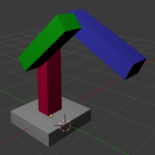
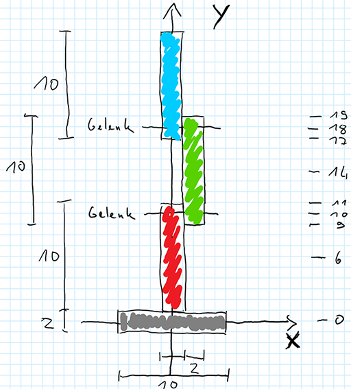
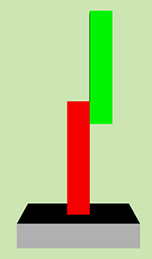
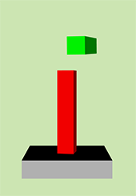
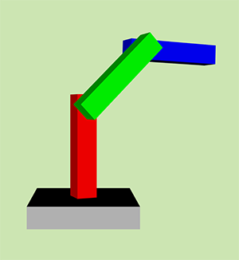

# Hierarchy & Input

## Lernziele

- Hierarchien und Transformationen verstehen
  - Eltern vererben ihre Transformation auf Kinder
  - Was ist der Pivot-Point und wie setze ich diesen
- Eingabe
  - Tastatur
  - Maus
  - Achsen

## Hierarchien

### Szenengraph in einer Anweisung

Der Source-Code dieser Lektion enthält eine leicht abgeänderte Version des letzten
Standes. 

> #### TODO
>
> - Öffnet den Ordner Tut09_HierarchyAndInput in Visual Studio Code, 
>   Erstellt das Projekt (Build) und lasst es im Debugger laufen.
> - Öffnet die Source-Code-Datei HierarchyInput.cs und betrachtet die Methoden
>   `Init()` und `RenderAFrame`.
> - Identifiziert Änderungen zur letzten Übung.

Wie in der Lektion 08 wird eine Szene, die nur aus einem Cuboid-Objekt (Quader)
besteht, erzeugt und gerendert. Allerdings ist der Quader nun grau und nicht mehr nicht würfelförmig.

Was hat sich noch gegenüber der letzten Lektion 08 geändert?: 

- Sämtlicher Animations-Code aus `RenderAFrame()` ist verschwunden.
- `Init()` sieht aufgeräumter aus: Das liegt daran, dass die Szene nun 
  in einer eigenen Methode namens `CreateScene()` erzeugt wird.
- Die Kamera wurde entlang der Hoch-Achse (Y) um 10 Einheiten nach oben verschoben.

Aber auch das Zusammensetzen der Szene aus Node und Komponenten innerhalb der Methode
`CreateScene()` sieht anders aus als beim letzten mal. Der Code, der die Szene erzeugt,
besteht nur aus einer einzelnen Anweisung (die sich allerding über mehrere Zeilen
erstreckt):

```C#
    return new SceneContainer
    {
        Children = new List<SceneNodeContainer>
        {
            new SceneNodeContainer
            {
                Components = new List<SceneComponentContainer>
                {
                    // TRANSFORM COMPONENT
                    _baseTransform,

                    // SHADER EFFECT COMPONENT
                    new ShaderEffectComponent
                    {
                        Effect = SimpleMeshes.MakeShaderEffect(new float3(0.7f, 0.7f, 0.7f), new float3(0.7f, 0.7f, 0.7f), 5)
                    },

                    // MESH COMPONENT
                    SimpleMeshes.CreateCuboid(new float3(10, 2, 10))
                }
            }
        }
    };
```

Möglich ist das durch ein Feature von C#, Eigenschaften ("Klassenvariablen"), Objekte, 
Arrays, Listen und andere so genannte Container-Klassen mit einfachen Anweisungen zu 
initialisieren. Das Ergebnis sieht fast ein bisschen wie eine JSON Datei aus - ein durchaus gewünschter Effekt.
Zumindest lässt mit dieser Schreibweise die hierarchische Struktur der Szene viel besser
erkennen, als im letzten Beispiel.

> #### TODO
>
> - Zeichnet den Szenengraphen auf, der durch o.a. Code erzeugt wird. Verwendet dazu die im Unterricht verwendete 
>   Darstellung: 
> 
>   - Szene: Orangenes Quadrat
>   - Nodes: Gelbe Quadrate
>   - Komponenten: grüne abgerundete Quadrate
>   - Komponentenlisten horizontal angeordnet
>   - Kind-Listen vertikal angeordnet
>
> - Überprüft, ob Eure Annahme stimmt, in dem Ihr einen Breakpoint _hinter_ den Aufruf von `CreateScene()`
>   setzt und im Watch-Fenster des Debugger die Hierarchie anschaut.
>
> - Lest den [Abschnitt im C# Programmierhandbuch, der die Objekt- und Auflistungsinitialisierer
>   erklärt](https://docs.microsoft.com/de-de/dotnet/articles/csharp/programming-guide/classes-and-structs/object-and-collection-initializers). Verdeutlich Euch, wie die Liste der drei Komponenten im vorigen Beispiel über Hinterinanderausführungen der
>   `Add()`-Anweisungen aufgebaut wurde und wie diese nun über eine durch Komma getrennte Aufzählung realisiert wird.
>

### Mehr Objekte

Es soll nun Zug um Zug ein Modell aufgebaut werden, dass so aussieht, wie der 
[Roboterarm aus der ersten Lektion](https://sftp.hs-furtwangen.de/~mch/computergrafik/script/chapter01/lecture01/#3-hierarchien):



Die Einzelteile des Roboters sollen im Folgenden einheitlich benannt werden:

- Graue Bodenplatte: `Base`
- Rote Säule: `Body`
- Grüner Oberarm: `UpperArm`
- Blauer Unterarm: `ForeArm`

Der Roboter soll zunächst so aufgebaut werden, dass alle Arme nach oben zeigen. Die kurzen Kantenlängen sollen jeweils zwei Einheiten
betragen, die langen Kanten sollen zehn Einheiten messen. Die Arme sollen sich jeweils zwei Einheiten überlappen, so dass die
"Gelenke" an jedem Arm jeweils eine Einheit nach innen ragen. Folgende Skizze soll dabei behilflich sein:



> #### TODO
>
> - Erzeugt ein weiteres Objekt (Node) im Szenengraphen, das aus einem roten länglichen Quader der Dimension (2, 10, 2)
>   besteht, der in der Mitte auf dem grauen Quader steht. Dazu muss
>   
>   - Ein neues Feld (Klassenvariable) für die Transformationskomponente eingefügt werden
>     (`TransformComponent _bodyTransform`)
>   - Ein zweiter mit `new` erzugter `SceneNodeContainer` in die `Children` Liste der Szene eingefügt werden, der
>     wiederum drei Komponenten enthält.
>
> - Versucht zunächst selbst die Stellen im o.a. Code zu finden, wo neue Stellen einzufügen sind. Falls es nicht klappt,
>   verwendet folgenden Code:
>

```C#
    private TransformComponent _baseTransform;
    private TransformComponent _bodyTransform;

    SceneContainer CreateScene()
    {
        // Initialize transform components that need to be changed inside "RenderAFrame"
        _baseTransform = new TransformComponent
        {
            Rotation = new float3(0, 0, 0),
            Scale = new float3(1, 1, 1),
            Translation = new float3(0, 0, 0)
        };
        _bodyTransform = new TransformComponent
        {
            Rotation = new float3(0, 0, 0),
            Scale = new float3(1, 1, 1),
            Translation = new float3(0, 6, 0)
        };

        // Setup the scene graph
        return new SceneContainer
        {
            Children = new List<SceneNodeContainer>
            {
                // GREY BASE
                new SceneNodeContainer
                {
                    Components = new List<SceneComponentContainer>
                    {
                        // TRANSFROM COMPONENT
                        _baseTransform,

                        // SHADER EFFECT COMPONENT
                        new ShaderEffectComponent
                        {
                            Effect = SimpleMeshes.MakeShaderEffect(new float3(0.7f, 0.7f, 0.7f), new float3(0.7f, 0.7f, 0.7f), 5)
                        },

                        // MESH COMPONENT
                        SimpleMeshes.CreateCuboid(new float3(10, 2, 10))
                    }
                },
                // RED BODY
                new SceneNodeContainer
                {
                    Components = new List<SceneComponentContainer>
                    {
                        _bodyTransform,
                         new ShaderEffectComponent
                        {
                            Effect = SimpleMeshes.MakeShaderEffect(new float3(1, 0, 0), new float3(0.7f, 0.7f, 0.7f), 5)
                        },
                        SimpleMeshes.CreateCuboid(new float3(2, 10, 2))
                    }
                }
            }
        };
    }
```

> #### TODO
>
> - Wer o.g. Code kopiert hat, sollte folgende Fragen bantworten können:
>
>   - Wo wird die Farbe für den roten body festgelegt? 
>   - Wo wird die Position für den roten Cuboid festgelegt?
>   - Warum ist dort festgelegt, dass der rote Cuboid 6 Einheiten entlang der Y-Achse transliert werden soll?
>   

## Kindeskinder

Nun soll der grüne Oberarm (`UpperArm`) folgen. Dieser könnte nun als weiteres Kind in die Szenenliste eingefügt werden.
Später wollen wir aber den Roboter bewegen. Dabei soll der grüne Arm allen Bewegungen der roten Säule (`Body`) folgen.
Wie bereits in Blender kann dieses Verhalten durch Eltern-Kind-Beziehungen erreicht werden. Solche können wir aufbauen,
weil alle `SceneNodeContainer`-Objekte ebenfalls die Möglichkeit haben, eine `Children`-Liste zu enthalten. 

Somit sollten wir den neu einzufügenden grünen Oberarm nicht als drittes Kind in die Szenen-Liste einfügen, sondern als 
(einziges) Kind der roten Säule. Folgender Code zeigt wie es geht: 

```C#
    // RED BODY
    new SceneNodeContainer
    {
        Components = new List<SceneComponentContainer>
        {
            _bodyTransform,
            new MaterialComponent
            {
                Diffuse = new MatChannelContainer { Color = new float3(1, 0, 0) },
                Specular = new SpecularChannelContainer { Color = new float3(1, 1, 1), Shininess = 5 }
            },
            SimpleMeshes.CreateCuboid(new float3(2, 10, 2))
        },
        Children = new List<SceneNodeContainer>
        {
            // GREEN UPPER ARM
            new SceneNodeContainer
            {
                Components = new List<SceneComponentContainer>
                {
                    _upperArmTransform,
                    new ShaderEffectComponent
                    {
                        Effect = SimpleMeshes.MakeShaderEffect(new float3(0, 1, 0), new float3(0.7f, 0.7f, 0.7f), 5)
                    },
                    SimpleMeshes.CreateCuboid(new float3(2, 10, 2))
                },
            }
        }
    }
```

> #### TODO
>
> - Fügt mit Hife des obenstehenden Code den grünen Arm als Kind der roten Säule hinzu.
> - erzeugt die `_upperArmTransform`-Komponente analog zu den beiden anderen Transform-Komponenten.
> - Setzt die Koordinaten des `Translation`-Feldes der Transform-Komponte so, dass der grüne Arm
>   exakt wie in o.a. Skizze und in folgdendem Screenshot erscheint.
>
>   
> 
> - Erklärt Euch anhand der Skizze, wie diese Koordinaten zustande kommen.

## Pivot Point

Da nun der grüne Oberarm ein Kind der roten Säule ist, müsste dieser ja alle Bewegungen des roten Armes 
mitmachen. Das wollen wir ausprobierern

> #### TODO
> 
> - Rotiert die rote Säule (`Body`) ein wenig um die Y-Achse, indem Ihr deren Transform-Komponente verändert:
>
>   ```C#
>      _bodyTransform = new TransformComponent
>      {
>          Rotation = new float3(0, 0.2f, 0),
>          Scale = new float3(1, 1, 1),
>          Translation = new float3(0, 6, 0)
>      };
>   ```
>
> - Um wieviel Grad wird mit o. a. Transform-Komponente die rote Säule um Y rotiert?
>

Als Ergebnis müsste die Säule jetzt inklusive dem daran hängenden Unterarm rotiert sein. Nun soll sich der grüne
Arm um seine lokale X-Achse gegenüber der roten Säule verdrehen lassen.

> #### TODO
> 
> - Rotiert den grünen Arm (`UpperArm`) ungefähr 90° um die X-Achse, indem Ihr dessen Transform-Komponente verändert:
>
>   ```C#
>      _upperArmTransform = new TransformComponent
>      {
>          Rotation = new float3(1.5f, 0, 0),
>          Scale = new float3(1, 1, 1),
>          Translation = new float3(2, 8, 0)
>      };
>   ```
>
> - Warum ist die Angabe `1.5f` ungefähr 90°?

Ergebnis? Der Roboter sieht ziemlich kapputt aus:



Der Grüne Arm scheint aus dem Gelenk gesprungen zu sein. Das liegt daran, dass der Koordinatenursprung des Cuboid-Körpers
immer in der Mitte des Quaders liegt. Sämtliche Transformationen in der `TransformComponent` beziehen sich auf
den Ursprung, so auch die Rotation. Das Rotationszentrum eines Körpers bezeichnet man auch mit ***Pivot Point***.

Notiz am Rande: Mit dem `Translation`-Feld (`Translation = new float3(2, 8, 0)`) haben wir die Mitte des grünen
Quaders so weit nach oben geschoben, bis wir die gewünschte Position erreicht haben. 

Wir wollen nun den Pivot Point verändern. Das können wir, indem wir eine weitere Ebene in unsere Hierachie einfügen, 
die allerdings kein Mesh (und auch kein Material enthält). Ausgehend von der Mitte der roten Säule schieben wir unser
Koordinatensystem mit Hilfe eines "leeren" `SceneNodeContainer` zunächst so weit nach oben, dass der Ursprung des 
neuen Koordinatensystem im Scharnier zwischen Grün und Rot liegt. In diese Node fügen wir dann eine weitere Child-Node
ein, die die eigentliche Geometrie enthält und diese an die richtige (relative) Position schiebt.

> #### TODO
>
> - Schreibt den Teil des Szenengraphen für den grünen Oberarm so um, dass dieser nun aus zwei Hierarchiestufen
>   besteht: Einer äußeren Node für den _Pivot Point_ und einer inneren Node für die Geometrie.
>
>   ```C#
>    // GREEN UPPER ARM
>    new SceneNodeContainer
>    {
>        Components = new List<SceneComponentContainer>
>        {
>            _upperArmTransform,
>        },
>        Children = new List<SceneNodeContainer>
>        {
>            new SceneNodeContainer
>            {
>                Components = new List<SceneComponentContainer>
>                {
>                    new TransformComponent
>                    {
>                        Rotation = new float3(0, 0, 0),
>                        Scale = new float3(1, 1, 1),
>                        Translation = new float3(0, 4, 0)
>                    },
>                    new MaterialComponent
>                    {
>                        Diffuse = new MatChannelContainer { Color = new float3(0, 1, 0) },
>                        Specular = new SpecularChannelContainer { Color = new float3(1, 1, 1), Shininess = 5 }
>                    },
>                    SimpleMeshes.CreateCuboid(new float3(2, 10, 2))
>                }
>            }
>        }
>    }
>   ```
>
> - Verändert die `TransformComponent`für den grünen Upper Arm, so dass dessen Pivot Point nun auf der Y-Achse
>   des Welt-Koordinatensystems bei 10 zum liegen kommt. Gemessen von der Mitte der roten Säule (die ja das 
>   Eltern-Objekt ist und daher der Ursprung des lokalen Koordinatensystems für dessen Kinder), sind das
>   4 Einheiten nach oben
>
>   ```C#
>   _upperArmTransform = new TransformComponent
>   {
>       Rotation = new float3(1.5f, 0, 0),
>       Scale = new float3(1, 1, 1),
>       Translation = new float3(2, 4, 0)
>   };
>   ```

Damit sollten die Bestandteile des Roboters (noch immer ohne blauen Unterarm) mit beliebigen Drehungen
der roten Säule um die Y-Achse und des grünen Arms um die X-Achse glaubhaft aussehen, ohne dass die 
Einzelteile auseinander gerissen werden.

Schließlich fehlt noch der blaue Unterarm.

> #### TODO
>
> - Fügt nach dem selben Schema wie oben den blauen Unterarm als Kindobjekt des grünen Arms ein.
>   Dabei muss der blaue Arm auch aus zwei Hierarchie-Ebenen bestehen: Einer, die den Nullpunkt
>   in das Scharnier zwischen Grün und Blau setzt und einer Kind-Ebene, die die Geometrie mit ihrem
>   Nullpunkt in der Mitte an die richtige Stelle setzt.
>
> - Macht Skizzen: 
>   - Zeichnet den gewünschten  Szenengraphen in der üblichen Knoten-Komponenten-Darstellung auf 
>   - Zeichnet die Ursprünge der lokalen Koordinatensysteme in o.A. Zeichnung ein. 
>
> - Bei Schwierigkeiten: Setzt alle Drehwinkel auf 0 zurück, um den Roboter in der nach oben gestreckten
>   Grundhaltung aufzubauen.
>
> - Sollte es gar nicht klappen, verwendet ***AUSNAHMSWEISE*** als Vorgriff die Implementierung im
>   [_Completed_-Projekt](../Tut09_HierarchyAndInputCompleted/HierarchyInput.cs#L27)
>


Als Ergebnis sollte der Roboter mit allen Armen so konstruiert sein, dass Drehung der roten Säule um die
Y-Achse und Drehungen der beiden Arme (grün, blau) jeweils um die X-Achse den Roboter in beliebige Stellungen
bringen, ohne die Einzelteile auseinander zu reißen.



## Eingabe

Nun sollen Benutzer in die Lage versetzt werden, den Roboter interaktiv zu steuern. Dazu müssen wir Benutzereingaben
entgegen nehmen und diese in Gelenkstellungen umwandeln.

In FUSEE können wir auf Benutzereingaben von diversen Eingabegeräte über die Klasse `Input` zugreifen. Diese besitzt
bereits statische Felder (Klassenvariablen) für die gebräuchlichsten Eingabegeräte, wie

- Maus (`Mouse`)
- Tastatur (`Keyboard`)
- Touch (`Touch`)

Mit der Anweisung 
```C#
using static Fusee.Engine.Core.Input;
```
ganz oben in der Datei [HierarchyInput.cs](HierarchyInput.cs#L12) können wir im Code direkt auf die o.G.
Felder für die Eingabegeräte zugreifen. 

> #### TODO
>
> - Tippt in einer neuen Zeile im Rumpf der Methode `RenderAFrame()` jeweils 
>   - `Mouse`
>   - `Keyboard`
>   - `Touch`
>
>   gefolgt von einem Punkt (`.`). Intellisense müsste dann ein Auswahlfenster mit den Eigenschaften der
>   jeweiligen Eingabegeräte anzeigen.

Im Folgenden sind für die Eingabegeräte Maus und Tastatur die wichtigsten auslesbaren Eigenschaften angezeigt. Diese
können jeweils in `RenderAFrame()` ausgelesen werden und die zurückgelieferten Werte für die Interaktion
verwendet werden.

### Maus

Eigenschaft              | Datentyp |  Beschreibung
-------------------------|----------|--------------------------
`Mouse.LeftButton`       | `bool`   | Gibt an, ob die linke Maustaste gerade gedrückt ist (`true`) oder nicht (`false`).
`Mouse.MidlleButton`     | `bool`   | Gibt an, ob die mittlere Maustaste gerade gedrückt ist (`true`) oder nicht (`false`).
`Mouse.RightButton`      | `bool`   | Gibt an, ob die rechte Maustaste gerade gedrückt ist (`true`) oder nicht (`false`).
`Mouse.Position`         | `float2` | Aktuelle Position des Maus-Cursor in Pixeln ((0, 0) = linke obere Ecke des Render-Fensters).
`Mouse.Velocity`         | `float2` | Aktuelle Geschwindigkeit des Maus-Cursor in Pixel/Sekunde entlang X- und Y-Achse.

### Tastatur

Eigenschaft                     | Datentyp |  Beschreibung
--------------------------------|----------|--------------------------
`Keyboard.GetKey(<KeyCode>)`    | `bool`   | Gibt an, ob die übergebene Taste gerade gedrückt ist (`true`) oder nicht (`false`).
`Keyboard.IsKeyDown(<KeyCode>)` | `bool`   | Gibt an, ob die übergebene Taste im aktuellen Frame heruntergedrückt wurde (`true`) oder nicht (`false`). Der Rückgabewert ist auch dann `false`, wenn die Taste noch gedrückt gehalten wird, aber nicht im aktuellen Frame heruntergedrückt wurde.
`Keyboard.IsKeyUp(<KeyCode>)`   | `bool`   | Gibt an, ob die übergebene Taste im aktuellen Frame losgelassen wurde (`true`) oder nicht (`false`). Der Rückgabewert ist auch dann `false`, wenn die Taste gerade nicht gedrückt ist, aber nicht im aktuellen Frame losgelassen wurde.
`Keyboard.LeftRightAxis`        | `float`   | 'Virtuelle' Achse, die durch Pfeil-Links und Pfeil-Rechts gesteuert wird. Wert zwischen -1 und 1. 
`Keyboard.UpDownAxis`           | `float`   | 'Virtuelle' Achse, die durch Pfeil-Hoch und Pfeil-Runter gesteuert wird. Wert zwischen -1 und 1. 
`Keyboard.ADAxis`               | `float`   | 'Virtuelle' Achse, die durch Taste 'A' und Taste 'D' gesteuert wird. Wert zwischen -1 und 1. 
`Keyboard.WSAxis`               | `float`   | 'Virtuelle' Achse, die durch Taste 'W' und Taste 'S' gesteuert wird. Wert zwischen -1 und 1. 

Mit den `...Axis` EigenSchaften der Tastatur lassen sich über die Tastatur Game-artige Steuerkreuze für die Pfeil und die 'WASD'-Tasten
implementieren, ohne aufwändige Einzelabfragen per "GetKey". Die Werte der Achsen im Intervall [-1...1] lassen sich als Geschwindigkeiten verwenden. Der aktuelle Achsenwert wird zudem bei Tastenänderung mit gewisser Trägheit beschleunigt/abgebremst.

Wir wollen nun den aktuellen Wert der `LeftRightAxis` dazu verwenden, die Rotation des Roboters um die rote Säule zu kontrollieren.

> #### TODO
>
> - Fügt folgenden Code an den Anfang des Rumpfes von `RenderAFrame()`
>
>   ```C#
>    public override void RenderAFrame()
>    {
>        float bodyRot = _bodyTransform.Rotation.y;
>        bodyRot += 0.1f * Keyboard.LeftRightAxis;
>        _bodyTransform.Rotation = new float3(0, bodyRot, 0);
>        ...
>   ```
> 

## Aufgabe

- Macht die Bewegung des Roboters unabhängig von der Framerate.
- Fügt Steuerungen für die beiden anderen Achsen des Roboters ein.
- Fügt eine Möglichkeit ein, dass Benutzer die Kamera mit der Maus um das Geschehen drehen können:
  - Bei gedrückter linker  Maustaste
    ([`Mouse.LeftButton`](https://github.com/FUSEEProjectTeam/Fusee/blob/develop/src/Engine/Core/MouseDevice.cs#L176))
    soll die X-Komponente der aktuellen Mausgeschwindigkeit 
    ([`Mouse.Velocity.x`](https://github.com/FUSEEProjectTeam/Fusee/blob/develop/src/Engine/Core/MouseDevice.cs#L101))
    als Parameter der Berechnung einer Änderungsrate für '_camAngle' verwendet werden.
  -  _Für Fortgeschrittene_: Baut eine Dämpfung ein, die den üblichen "Swipe"-Effekt nachstellt: Durch Maustaste-Drücken, 
    horizontales Bewegen und Loslassen während der Bewegung soll die aktuelle Drehgeschwindigkeit
    zunächst beibehalten werden und dann mit der Zeit abnehmen, bis die Drehung nach einer
    gewissen Zeit zum Stillstand kommt.
- Fügt eine Greifhand (aus zwei oder drei weiteren Quadern) in die Hierarchie ein und ermöglicht Benutzern, diese
  zu Öffnen und zu Schließen. Wie kann gewährleistet werden, dass es Zustände wie "ganz offen" und "ganz geschlossen"
  gibt, die nicht über- oder unterschritten werden können?
- _Für Fortgeschrittene_: Schön wäre es, das Öffnen und Schließen jeweils durch einen einmaligen Tastendruck
  ([`Keyboard.GetKey()`](https://github.com/FUSEEProjectTeam/Fusee/blob/develop/src/Engine/Core/KeyboardDevice.cs#L46))
  triggern zu können, nachdem der jeweilige Vorgang (Öffnen oder Schließen) dann selbständig abläuft.


 


